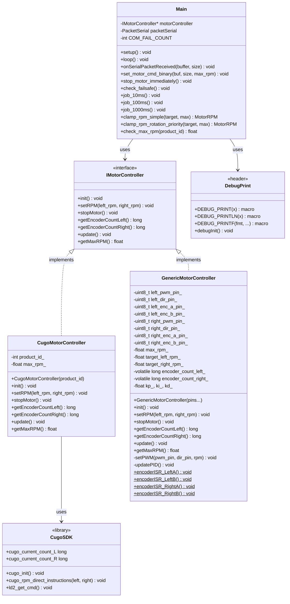
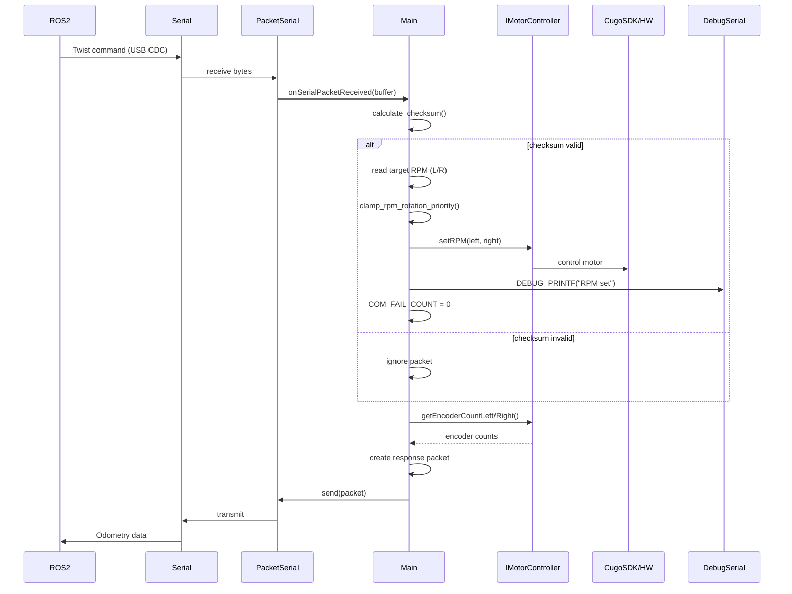
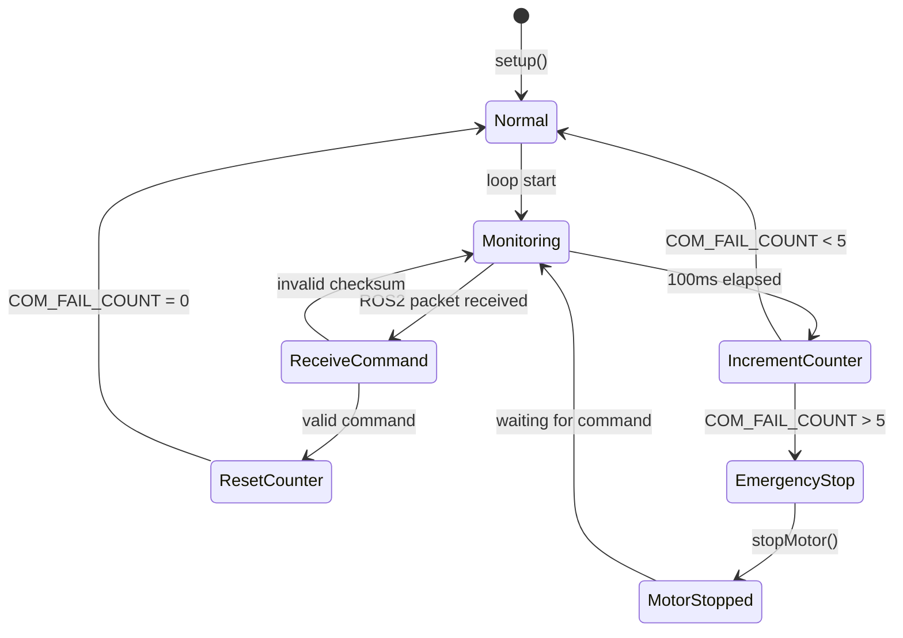
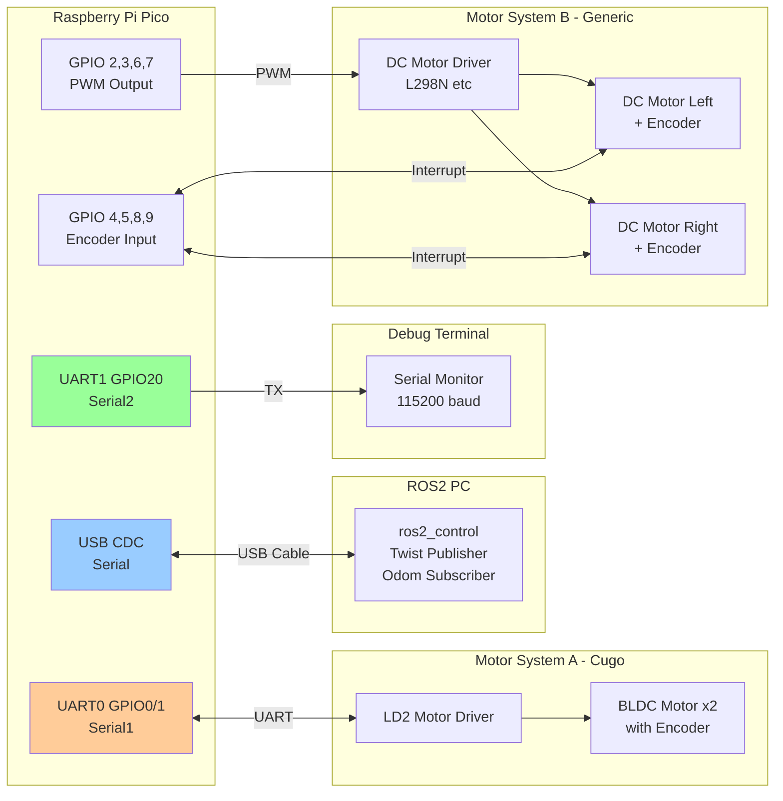

# アーキテクチャ設計

このドキュメントでは、Cugo ROS2 Motor Controller 2のアーキテクチャ設計をMermaid図を用いて説明します。

## 目次

1. [システム全体図](#システム全体図)
2. [クラス図](#クラス図)
3. [シーケンス図](#シーケンス図)
4. [周期タスクフロー](#周期タスクフロー)
5. [コンポーネント図](#コンポーネント図)
6. [状態遷移図](#状態遷移図)
7. [デプロイメント図](#デプロイメント図)

---

## システム全体図

```text
┌───────────────────────────────────────────────────────────┐
│                    Raspberry Pi Pico                      │
│                                                           │
│  ┌────────────────────────────────────────────────────┐   │
│  │           main.cpp (Main Loop)                     │   │
│  │                                                    │   │
│  │  • IMotorController* (Abstract Interface)          │   │
│  │  • RPM Clamping Logic                              │   │
│  │  • Failsafe Monitoring                             │   │
│  └────┬────────┬─────────────┬────────────────────────┘   │
│       │        │             │                            │
│       │Serial  │Serial2      │IMotorController            │
│       │(USB)   │(Debug)      │Interface                   │
│       │        │             │                            │
│       │        │             ├──────────┬──────────┐      │
│       │        │             │          │          │      │
│       │        │         ┌───▼────┐  ┌──▼──────┐   │      │
│       │        │         │  Cugo  │  │ Generic │   │      │
│       │        │         │ Motor  │  │ Motor   │   │      │
│       │        │         │Control │  │ Control │   │      │
│       │        │         └───┬────┘  └──┬──────┘   │      │
│       │        │             │          │          │      │
│       ▼        ▼             │          │          │      │
│  ┌───────┐ ┌──────┐          │          │          │      │
│  │ ROS2  │ │Debug │          │          │          │      │
│  │  I/F  │ │ Log  │          │          │          │      │
│  └───────┘ └──────┘          │          │          │      │
│                              │          │          │      │
│                       ┌───────▼──────┐  │          │      │
│                       │   Serial1    │  │          │      │
│                       │   (UART0)    │  │          │      │
│                       │   CugoSDK    │  │          │      │
│                       └──────┬───────┘  │          │      │
│                              │          │          │      │
│                       ┌──────▼────────┐ │          │      │
│                       │  LD2 Driver   │ │          │      │
│                       └───────────────┘ │          │      │
│                                         │          │      │
│                                ┌────────▼──────┐   │      │
│                                │  PWM + Enc    │   │      │
│                                │   (GPIO)      │   │      │
│                                └───────────────┘   │      │
└───────────────────────────────────────────────────────────┘
```

---

## クラス図

モーター制御のクラス構造を示します。`IMotorController`インターフェイスにより、異なるモーターシステムを統一的に扱えます。



### クラスの役割

#### `IMotorController` (インターフェイス)

モーター制御の抽象インターフェイス。異なるモーターシステムを統一的に扱うための仕様を定義。

**主要メソッド:**

- `init()`: モーターシステムの初期化
- `setRPM(left, right)`: 左右モーターのRPM指令
- `getEncoderCountLeft/Right()`: エンコーダーカウント取得
- `update()`: 周期更新処理（エンコーダー読み取り、PID制御など）

#### `CugoMotorController`

CugoSDKを使用したモーター制御の実装。既存のCugo専用モータードライバー(LD2)を使用。

#### `GenericMotorController`

一般的なDCモーター + インクリメンタルエンコーダーを使用した実装。PWM制御とPIDフィードバック制御のスケルトン実装を含む。

#### `Main` (main.cpp)

アプリケーションのメインロジック。ROS2プロトコル処理、RPMクランプ、フェイルセーフ機構を実装。

---

## シーケンス図

### ROS2コマンド受信フロー

ROS2からTwistコマンドを受信し、モーターに反映、Odomを返送する一連の流れを示します。



### 処理の流れ

1. **受信**: ROS2からUSB経由でTwistコマンド受信
2. **検証**: チェックサムで通信データの整合性確認
3. **クランプ**: RPM値を物理的上限内に制限（回転優先アルゴリズム）
4. **制御**: モーターコントローラーにRPM指令
5. **デバッグ**: Serial2にデバッグログ出力
6. **応答**: エンコーダーカウントを取得してOdom返送

---

## 周期タスクフロー

メインループ内で実行される周期タスクは、`micros()`で取得した現在時刻と前回実行時刻の差分により、それぞれ独立した周期で動作します。

### 10ms周期タスク (`job_10ms()`)

**現在の実装**: 未使用

**用途**: 将来の拡張用（高速制御ループなど）

### 100ms周期タスク (`job_100ms()`)

このタスクは100ms（0.1秒）ごとに実行され、以下の2つの処理を行います：

1. **フェイルセーフチェック** (`check_failsafe()`)
   - `COM_FAIL_COUNT`を1増加
   - 5回連続（500ms）でROS2からの通信がない場合、モーターを緊急停止
   - 正常にコマンドを受信すると、カウンターはリセットされる

2. **モーターコントローラー更新** (`motorController->update()`)
   - **CugoSDK使用時**: `ld2_get_cmd()` でエンコーダーデータを取得
   - **汎用DCモータ使用時**: `updatePID()` でPID制御による速度フィードバック

### 1000ms周期タスク (`job_1000ms()`)

**現在の実装**: 未使用

**用途**: 将来の拡張用（統計情報出力、診断など）

### 毎ループ実行

**PacketSerial更新** (`packetSerial.update()`)

ループごとに実行され、ROS2からのパケット受信を処理します。パケットが完全に受信されると、`onSerialPacketReceived()`コールバックが呼び出されます。

---

## コンポーネント図

システムのレイヤー構造と各コンポーネントの依存関係を示します。

```mermaid
graph TB
    subgraph "Raspberry Pi Pico"
        subgraph "Application Layer"
            MainCpp[main.cpp<br/>- ROS2 protocol<br/>- RPM clamping<br/>- Failsafe]
        end

        subgraph "Abstraction Layer"
            IMotor[IMotorController<br/>Interface]
        end

        subgraph "Implementation Layer"
            CugoImpl[CugoMotorController]
            GenericImpl[GenericMotorController]
        end

        subgraph "Hardware Abstraction"
            CugoSDK[CugoSDK<br/>- LD2 Protocol<br/>- Serial1 (UART0)]
            GPIO[GPIO/PWM<br/>- Motor PWM<br/>- Encoder INT]
        end

        subgraph "Debug Layer"
            DebugPrint[DebugPrint<br/>Serial2 (UART1) Debug Output]
        end

        subgraph "Communication"
            PacketSerial[PacketSerial<br/>Serial USB CDC]
        end
    end

    subgraph "External Hardware"
        ROS2[ROS2 PC<br/>Twist/Odom]
        LD2[LD2 Motor Driver<br/>BLDC + Encoder]
        DCMotor[DC Motor Driver<br/>PWM + Encoder]
        DebugPC[Debug Terminal<br/>USB-Serial]
    end

    MainCpp --> IMotor
    MainCpp --> PacketSerial
    MainCpp --> DebugPrint

    IMotor -.-> CugoImpl
    IMotor -.-> GenericImpl

    CugoImpl --> CugoSDK
    GenericImpl --> GPIO

    PacketSerial <--> ROS2
    CugoSDK <--> LD2
    GPIO <--> DCMotor
    DebugPrint --> DebugPC

    style IMotor fill:#ff9,stroke:#333,stroke-width:3px
    style CugoImpl fill:#9f9
    style GenericImpl fill:#9f9
```

### レイヤーの説明

1. **Application Layer**: ビジネスロジック（ROS2プロトコル、安全機能）
2. **Abstraction Layer**: ハードウェア非依存の抽象インターフェイス
3. **Implementation Layer**: 具体的なモーター制御の実装
4. **Hardware Abstraction**: ハードウェア直接制御
5. **Debug Layer**: デバッグ支援機能
6. **Communication**: 外部通信

この構造により、モーターシステムの変更が上位レイヤーに影響しません。

---

## 状態遷移図

フェイルセーフ機構の状態遷移を示します。



### フェイルセーフの動作

1. **Normal**: 正常動作状態
2. **Monitoring**: 100ms周期で通信を監視
3. **ReceiveCommand**: ROS2からコマンド受信時、カウンターリセット
4. **IncrementCounter**: 100ms経過ごとにカウンターを増加
5. **EmergencyStop**: 5回連続（500ms）通信がない場合、緊急停止
6. **MotorStopped**: モーター停止状態、通信復帰まで待機

---

## デプロイメント図

ハードウェアの物理的な接続関係を示します。



### ピンアサイン

#### 共通

- **USB CDC (Serial)**: ROS2通信
- **UART1 GPIO20 (Serial2)**: デバッグ出力

#### モーターシステムA: Cugo

- **UART0 GPIO0/1 (Serial1)**: LD2モータードライバー通信

#### モーターシステムB: 汎用

- **GPIO 2, 3**: 左モーター PWM/DIR
- **GPIO 6, 7**: 右モーター PWM/DIR
- **GPIO 4, 5**: 左エンコーダー A/B相
- **GPIO 8, 9**: 右エンコーダー A/B相

※ピン番号は実際のハードウェアに合わせて変更してください

---

## 設計の利点

### 1. 拡張性

- 新しいモーターシステムは`IMotorController`を実装するだけで追加可能
- ステッピングモーター、サーボモーターなども対応可能

### 2. 保守性

- レイヤー分離により、変更の影響範囲が限定される
- デバッグ出力により問題の特定が容易

### 3. 再利用性

- モーター制御ライブラリは他のプロジェクトでも利用可能
- インターフェイスにより、テストも容易

### 4. 安全性

- フェイルセーフ機構により通信断時に自動停止
- RPMクランプにより物理的限界を超えない

---

[← README](README.md) | [使い方 →](usage.md)
